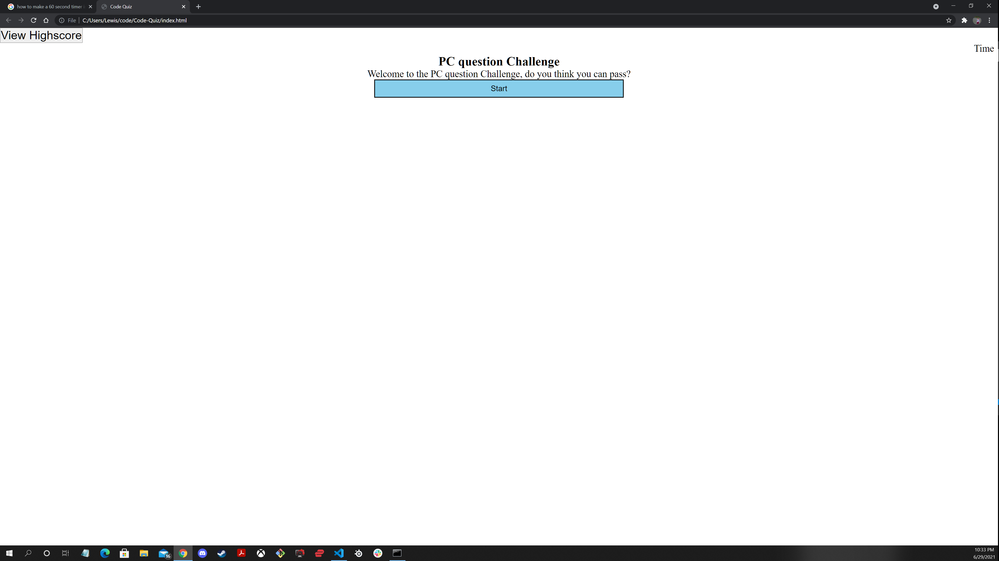

# Code-Quiz

This project was difficult for me. I have a hard time setting some of the functions to do certain task. 
Overall I understand the basics of javascript and how it works, but I get very mixed up when it comes to setting up certain functions and things of that sort. I get the concepts in a basic sense but combining functions and trying to complete certain functions I get confused. 

[Github](https://github.com/LewisCapers206/Code-Quiz)